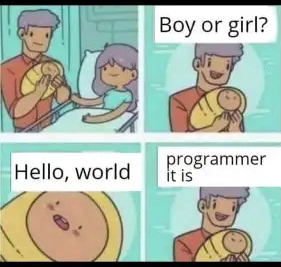

<a href="https://www.linkedin.com/in/dawid-piech-2a2999159/" style="text-decoration: none; color: white; display: flex; align-items: center; font-weight: 900">
  
  Linkedin profile
</a>

  <ul style="padding: 50px">
    <h2 style="dispaly: box; padding: 0; margin: 0 0 0 -40px;">⚡️ A Few Quick Facts</h2>
    <li>🧐 I graduated in computer science and econometrics</li>
    <li>👨‍💻 Most of my projects are available on <a href="https://piech.it/">my portfolio website</a>.</li>
    <li>📝 I am often active on <a href="https://www.linkedin.com/in/dawid-piech-2a2999159/">LinkedIn</a>.</li>
    <li>💬 Ping me about <strong>Frontend, React.js</strong>.</li>
    <li>📙 Check out my <a href="https://piech.it/static/media/CV.7e027fc792a8a0b792bd.pdf">resume</a>.</li>
    <li>🎉 Fun Fact: I could have wheels instead of legs 🚘</li>
  </ul>
  

 

 